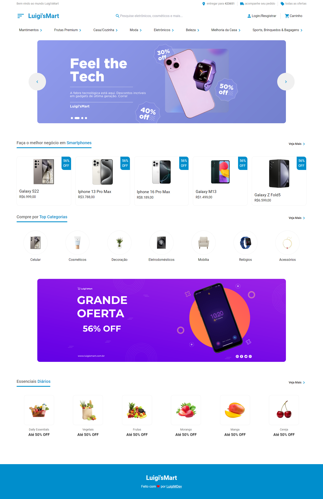

# Luigi'sMart - E-commerce

Bem-vindo ao **Luigi'sMart**, um projeto de e-commerce moderno e responsivo, desenvolvido com **React**, **TailwindCSS** e **TypeScript**. Este é um marketplace online que oferece uma experiência de usuário fluida, intuitiva e otimizada para dispositivos móveis e desktops.

## GitHub Pages

https://luigimdev.github.io/LuigisMart/

## 🚀 Tecnologias Utilizadas

- **React**: Biblioteca JavaScript para construir interfaces de usuário dinâmicas e componentizadas.
- **TypeScript**: Superset de JavaScript que adiciona tipagem estática, auxiliando no desenvolvimento seguro e escalável.
- **TailwindCSS**: Framework de CSS utilitário que permite a criação rápida de designs responsivos e customizáveis.
  
## 💻 Funcionalidades

- **Página de Produtos**: Exibição de produtos com preços, descontos e categorias.
- **Banner Promocional**: Destaque de ofertas especiais e novos gadgets tecnológicos.
- **Categorias de Produtos**: Filtro de produtos por categorias como celulares, cosméticos, eletrodomésticos, etc.
- **Descontos Especiais**: Exibição de descontos por produto diretamente na interface.
- **Responsividade**: Layout otimizado para dispositivos móveis e desktop.
  
## 📦 Instalação

1. Clone o repositório:

   ```bash
   git clone https://github.com/seu-usuario/luigismart.git
   ```
2. Navegue até o diretório do projeto:
3. ```bash
   cd luigismart
4. Instale as dependências:
5. ```bash
   npm install
6. Inicie o servidor de desenvolvimento:
7. ```bash
   npm run dev
# 🛠 Estrutura do Projeto

- **src/components**: Componentes reutilizáveis da interface.
- **src/pages**: Páginas principais da aplicação (home, categorias, etc).
- **src/assets**: Imagens e outros arquivos estáticos.
- **src/styles**: Configurações de estilo utilizando TailwindCSS.

# 🔧 Scripts Disponíveis

- `npm run dev`: Inicia o ambiente de desenvolvimento.
- `npm run build`: Gera o build otimizado para produção.
- `npm run lint`: Verifica o código utilizando linters.
- `npm run test`: Roda os testes unitários do projeto.

# 🖼️ Preview

Aqui está uma prévia da interface:



# 📄 Licença

Este projeto está licenciado sob a MIT License.

# 🤝 Contribuições

Contribuições são sempre bem-vindas! Sinta-se à vontade para abrir issues ou enviar pull requests para melhorias e novas funcionalidades.
   
